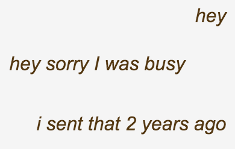

 

# p5.typewriter.js
## A simple little library that writes your text to the screen with Typewriter effect.

- Version 0.5 | 16.09.2019
- by Olaf Val
- CC BY 4.0


Within a text box, Speed = 0 means that the text can be seen directly without typewriter animation.


## Reference

**Syntax:**
```javascript
tw = new Typewriter();
tw.twTyp(t, x, y);
tw.twSpeed(s);
tw.twAlign(a);
tw.twCompleted() // returns true when the line is finished
tw.twRestart(); // restarts the typing process (for all lines)
tw.twBox(x, y, w, h); // if you want to place a line break, use <br>
```

**Parameters:**
```
t = String (my text)
x = X Position ()
y = Y Position
w = Box Width
h = Box Height
s = int Speed (delay in microseconds)
a = text align (LEFT, RIGHT or CENTER)
```


## Examples

 **Basic** <br>

 **McLuhan Quote**<br>

 **Chat Meme**<br>


## ToDo

- [ ] Line feed at text box end
- [ ] Scrollbar for text box
- [ ] Typing sounds

<br>
