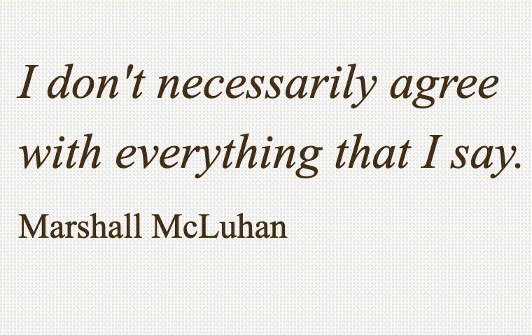

# p5.typewriter.js
## A simple little library that writes your text to the screen with Typewriter effect.

- Version 0.5 | 16.09.2019
- by Olaf Val
- CC BY 4.0


## Reference

**Syntax:**
```javascript
tw = new Typewriter();
tw.twTyp(10, 10, 'This is my example text.');
tw.twSpeed(s);
tw.twCompleted()
```

**Parameters:**
```javascript
s = int Speed (delay in microseconds)
t = String (my text)
```


## Examples

Basic 

Big-Letters

<br>
