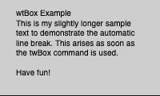

 

# Typewriter.js
## A simple little library that writes your text to the screen with Typewriter effect for p5js.

- Version 0.5 | 16.09.2019
- by Olaf Val
- CC BY 4.0

The <b>twTyp()</b> command simply writes a line of text letter by letter on the screen. This works either left or right aligned or centered. In addition <b>twBox()</b> offers a rudimentary function to display entire text blocks on the p5js canvars. Within a text box, twSpeed(0) means that the text can be seen directly without typewriter animation. If the coordinates of the twBox() command are set, they overwrite the x and y coordinates of the twType() command.


## Reference

**Syntax:**
```javascript
tw = new Typewriter();
tw.twType(t, x, y);
tw.twSpeed(s);
tw.twAlign(a);
tw.twCompleted() // returns true when the line is finished
tw.twRestart(); // restarts the typing process (for all lines)
tw.twLines(); // Returns the current number of lines in the Box (can be used to trigger a line feed)
tw.twBox(x, y, w, h); // if you want to place a line break, use <br>
```

**Parameters:**
```
t = String (my text)
x = X Position ()
y = Y Position
w = Box Width
h = Box Height
s = int Speed (delay in microseconds)
a = text align (LEFT, RIGHT or CENTER)
```


## Examples

 **Basic** [view](http://projects.olafval.de/p5-typewriter/basic.html) / [code](Examples/basic.js)<br><br>

 **McLuhan Quote** [view](http://projects.olafval.de/p5-typewriter/mcluhanquote.html) / [code](Examples/mcluhanquote.js)<br>

 **Chat Meme** [view](http://projects.olafval.de/p5-typewriter/chat-meme.html) / [code](Examples/chat-meme.js)<br>

 **twBox-Example** [view](http://projects.olafval.de/p5-typewriter/twBox-example.html) / [code](Examples/twBox-example.js)<br>


## ToDo

- [ ] Line feed at text box end
- [ ] Scrollbar for text box
- [ ] Typing sounds

<br>
